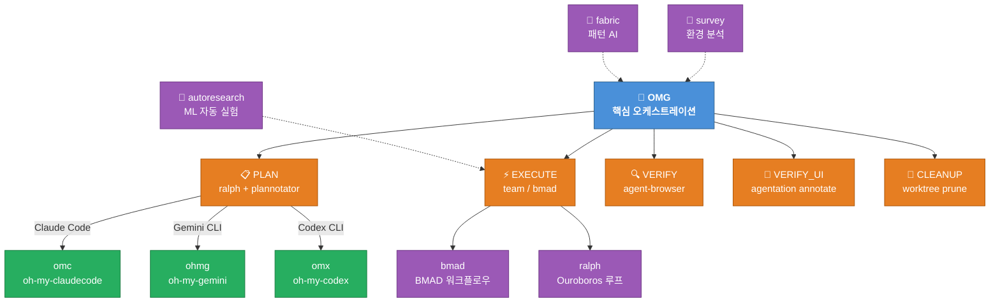
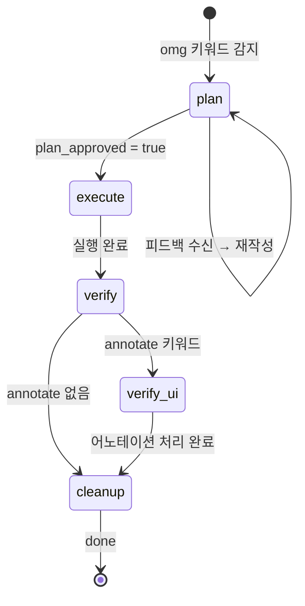
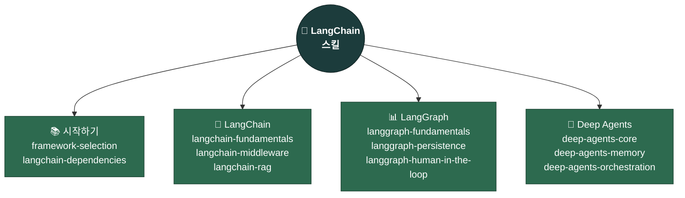

# oh-my-gods

<div align="center">

[](https://github.com/akillness/oh-my-gods)
[](https://github.com/akillness/oh-my-gods)
[](LICENSE)
[](CHANGELOG.md)
[](https://github.com/langchain-ai/langchain-skills)
[](https://www.buymeacoffee.com/akillness3q)

</div>

```
  ██████╗ ██╗  ██╗      ███╗   ███╗██╗   ██╗      ██████╗  ██████╗ ██████╗ ███████╗
 ██╔═══██╗██║  ██║      ████╗ ████║╚██╗ ██╔╝     ██╔════╝ ██╔═══██╗██╔══██╗██╔════╝
 ██║   ██║███████║█████╗██╔████╔██║ ╚████╔╝█████╗██║  ███╗██║   ██║██║  ██║███████╗
 ██║   ██║██╔══██║╚════╝██║╚██╔╝██║  ╚██╔╝ ╚════╝██║   ██║██║   ██║██║  ██║╚════██║
 ╚██████╔╝██║  ██║      ██║ ╚═╝ ██║   ██║         ╚██████╔╝╚██████╔╝██████╔╝███████║
  ╚═════╝ ╚═╝  ╚═╝      ╚═╝     ╚═╝   ╚═╝          ╚═════╝  ╚═════╝ ╚═════╝ ╚══════╝
```

<div align="center">

**LLM 기반 AI 에이전트 개발을 위한 완전한 워크플로우 & 스킬셋**

*Plan → Execute → Verify → Ship*

> **88개 이상의 스킬** — 신규 추가: `pm-skills` — PM용 AI OS — 65개 스킬, 36개 명령어, 8개 플러그인

[빠른 시작](#-빠른-시작) · [OMG 핵심](#-omg--핵심-오케스트레이션-스킬) · [숨겨진 기능](#-숨겨진-강력-기능) · [LangChain](#-langchain-통합) · [전체 카탈로그](#-전체-스킬-카탈로그) · [English](README.md)

</div>

---

## 🚀 빠른 시작

> **사전 조건**: `npx skills add` 명령 실행 전에 반드시 `skills` CLI를 설치하세요.

```bash
npm install -g skills
```

```bash
# LLM 에이전트에게 이 가이드를 전달하면 자동으로 설치를 진행합니다
curl -s https://raw.githubusercontent.com/akillness/oh-my-gods/main/setup-all-skills-prompt.md
```

```bash
# 또는 원라인으로 설치
curl -fsSL https://raw.githubusercontent.com/akillness/oh-my-gods/main/install.sh | bash
```

```bash
# 수동 — 핵심 OMG 스택만 설치
npx skills add https://github.com/akillness/oh-my-gods \
  --skill omg --skill plannotator --skill agentation --skill survey \
  --skill ralph --skill omc --skill bmad
```

| 플랫폼 | 첫 번째 명령 |
|--------|-------------|
| Claude Code | `omg "작업 설명"` 또는 `/omc:team "작업"` |
| Gemini CLI | `/omg "작업 설명"` |
| Codex CLI | `/omg "작업 설명"` |
| OpenCode | `/omg "작업 설명"` |

---

## 🎯 oh-my-gods란?

`oh-my-gods`는 LLM 기반 개발 워크플로우를 위한 **86개 이상의 AI 에이전트 스킬** 모음입니다. `omg` 오케스트레이션 프로토콜을 중심으로 구성되어 있으며 다음을 제공합니다:

- **통합 오케스트레이션** — Claude Code, Gemini CLI, OpenAI Codex, OpenCode 전 플랫폼 지원
- **Plan → Execute → Verify → Cleanup** 자동화 파이프라인
- **멀티에이전트 팀 협업** 및 병렬 실행
- **LangChain/LangGraph 통합** — 프레임워크 인식 에이전트 개발

---

## 🏗 아키텍처



---

## 🧠 OMG — 핵심 오케스트레이션 스킬

> **키워드**: `omg` · `annotate` · `UI검토`
> **oh-my-gods의 중추 신경계**

OMG는 모든 AI 에이전트 플랫폼에서 완전 자동화된 개발 파이프라인을 오케스트레이션합니다.

```
┌─────────────────────────────────────────────────────────────────┐
│                     OMG 워크플로우                               │
├──────────┬──────────┬──────────┬──────────┬────────────────────┤
│  STEP 0  │  STEP 1  │  STEP 2  │  STEP 3  │  STEP 4            │
│ 부트스트랩│   PLAN   │ EXECUTE  │  VERIFY  │  CLEANUP           │
│          │          │          │          │                    │
│ 상태 초기화│ ralph   │ omc:team │ agent-   │ worktree           │
│          │    +     │    또는  │ browser  │ prune              │
│          │ planno-  │  bmad    │    +     │                    │
│          │ tator    │          │ agenta-  │                    │
│          │          │          │ tion     │                    │
└──────────┴──────────┴──────────┴──────────┴────────────────────┘
```

### OMG 상태 머신



### 플랫폼 지원

| 플랫폼 | 팀 모드 | PLAN 게이트 | VERIFY_UI | 설치 |
|--------|---------|------------|-----------|------|
| **Claude Code** | `/omc:team` | ExitPlanMode 훅 | MCP 도구 | `bash setup-claude.sh` |
| **Gemini CLI** | `ohmg` | AfterAgent 훅 | HTTP REST | `bash setup-gemini.sh` |
| **Codex CLI** | `omx` | notify 훅 | HTTP REST | `bash setup-codex.sh` |
| **OpenCode** | `omx` | submit_plan 플러그인 | HTTP REST | `bash setup-opencode.sh` |

---

## 🔮 숨겨진 강력 기능

> 이 기능들이 oh-my-gods 생태계의 진정한 잠재력을 발휘합니다.

```
╔══════════════════════════════════════════════════════════════════╗
║                숨겨진 강력 기능                                   ║
╠══════════════╦═══════════════════════════════════════════════════╣
║  omc         ║  Claude Code 32개 에이전트 오케스트레이션         ║
║  omx         ║  OpenAI Codex 멀티에이전트 오케스트레이션         ║
║  ohmg        ║  Gemini / Antigravity 워크플로우 (Google AI)     ║
║  bmad        ║  단계 기반 구조적 개발 (BMAD 방법론)              ║
║  bmad-idea   ║  창의적 AI — 5개 전문 아이디에이션 에이전트       ║
║  survey      ║  구현 전 환경 분석 스캔                           ║
║  autoresearch║  자율 야간 ML 실험 (Karpathy 방법론)              ║
║  fabric      ║  재사용 패턴 기반 AI 프롬프트 오케스트레이션 CLI  ║
║  agentation  ║  UI 어노테이션 → 에이전트 코드 수정 (annotate)   ║
║  plannotator ║  시각적 계획/diff 리뷰 브라우저 UI               ║
║  agent-browser║ AI 에이전트용 헤드리스 브라우저 검증             ║
║  playwriter  ║  실제 브라우저 연결 Playwright 자동화             ║
║  frouter     ║  무료 AI 모델 라우터 — 탐색 & 설정               ║
║  deepagents  ║  LangGraph 배터리 포함 AI 에이전트 하네스         ║
║  clawteam    ║  프레임워크 무관 멀티에이전트 조율 CLI             ║
║  agent-manager║ tmux+Python 에이전트 생명주기 관리 — 서버 불필요 ║
║  pm-skills   ║  PM용 AI OS — 65개 스킬, 36개 명령어, 8개 플러그인║
╚══════════════╩═══════════════════════════════════════════════════╝
```

| 스킬 | 키워드 | 설명 | 출처 |
|------|--------|------|------|
| `omc` | `omc`, `autopilot` | 32개 특화 에이전트, 스마트 모델 라우팅, 실시간 HUD | [oh-my-claudecode](https://github.com/Yeachan-Heo/oh-my-claudecode) |
| `omx` | `omx` | 40개+ 워크플로우 스킬, tmux 팀 오케스트레이션 | 내부 |
| `ohmg` | `ohmg` | Google Antigravity/Gemini 멀티에이전트 프레임워크 | 내부 |
| `bmad` | `bmad`, `/workflow-init` | 분석→계획→솔루션→구현 구조화 단계 | [BMAD Method](https://github.com/bmad-dev/BMAD-METHOD) |
| `bmad-idea` | `bmad-idea` | 5개 창의적 전문 에이전트 — 디자인 씽킹, 혁신, 스토리텔링 | 내부 |
| `survey` | `survey` | 구현 전 크로스 플랫폼 환경 분석; `.survey/`에 결과물 저장 | 내부 |
| `autoresearch` | `autoresearch`, `val_bpb` | Karpathy 스타일 자율 GPU 야간 실험 및 git 래칫 | Karpathy 방법론 |
| `fabric` | `fabric` | 재사용 패턴 AI 프롬프트; YouTube 요약, 문서 분석 | [fabric](https://github.com/danielmiessler/fabric) |
| `agentation` | `annotate`, `UI검토` | UI 요소 클릭 → AI가 CSS 선택자로 코드 수정 | [agentation](https://github.com/benjitaylor/agentation) |
| `plannotator` | `plan` | AI 생성 계획 브라우저 리뷰 UI; 승인 또는 피드백 전송 | [plannotator](https://plannotator.ai) |
| `agent-browser` | `agent-browser` | AI 에이전트용 헤드리스 브라우저 스냅샷 및 검증 | npm:agent-browser |
| `playwriter` | `playwriter` | 실행 중인 브라우저에 연결하는 Playwright 자동화 | 내부 |
| `frouter` | `frouter`, `--best` | 무료 AI 모델 라우터 — NVIDIA NIM / OpenRouter 모델 탐색·벤치마크·설정 | [jyoung105/frouter](https://github.com/jyoung105/frouter) |
| `deepagents` | `deepagents`, `create_deep_agent` | 배터리 포함 LangGraph 에이전트 하네스 — 파일 도구, 미들웨어, 서브에이전트, HITL 즉시 사용 가능 | [langchain-ai/deepagents](https://github.com/langchain-ai/deepagents) |
| `clawteam` | `clawteam`, `agent swarm` | 프레임워크 무관 멀티에이전트 조율 CLI — tmux 팀 스폰, 태스크 큐, 인박스, 칸반 보드 | [HKUDS/ClawTeam](https://github.com/HKUDS/ClawTeam) |
| `agent-manager` | `agent-manager`, `start agent`, `stop agent`, `monitor agent` | tmux + Python 에이전트 생명주기 관리 — 서버 없이 시작/중지/모니터/일정 예약/하트비트 | [fractalmind-ai/agent-manager-skill](https://github.com/fractalmind-ai/agent-manager-skill) |
| `pm-skills` | `pm-skills`, `product discovery`, `write PRD`, `user stories`, `product strategy` | PM용 AI OS — Teresa Torres, Marty Cagan, Alberto Savoia 프레임워크를 담은 65개 스킬, 36개 명령어, 8개 플러그인 | [phuryn/pm-skills](https://github.com/phuryn/pm-skills) |

---

## 🔗 LangChain 통합

> **출처**: [`langchain-ai/langchain-skills`](https://github.com/langchain-ai/langchain-skills/tree/main)
> MIT 라이선스 — LangChain AI 공식 에이전트 개발 스킬

oh-my-gods는 공식 LangChain 스킬 컬렉션을 통합하여 LangChain/LangGraph/Deep Agents 애플리케이션 개발에 필요한 프레임워크 인식 가이던스를 제공합니다.

```bash
# 모든 LangChain 스킬 설치
npx skills add langchain-ai/langchain-skills --skill '*' --yes
```

### LangChain 스킬 구조



### 프레임워크 선택 가이드

| 사용 사례 | 권장 프레임워크 |
|----------|--------------|
| 다단계 작업, 파일 관리, 온디맨드 스킬 | **Deep Agents** |
| 복잡한 제어 흐름 (루프, 분기, 병렬화) | **LangGraph** |
| 도구를 사용하는 단순 단일 에이전트 | **LangChain** `create_agent()` |
| 순수 모델 호출 / 검색 파이프라인 | **LangChain LCEL** |

### LangChain 스킬 목록

| 스킬 | 트리거 | 설명 |
|------|--------|------|
| `framework-selection` | "어떤 프레임워크", "LangChain vs" | LangChain/LangGraph/Deep Agents 선택 |
| `langchain-dependencies` | "langchain 설치", "패키지 버전" | 패키지 설정 및 버전 관리 |
| `langchain-fundamentals` | "langchain agent", "create_agent" | 에이전트 생성, @tool 데코레이터, 구조화 출력 |
| `langchain-middleware` | "human in the loop", "승인 워크플로우" | HITL 승인, 커스텀 미들웨어 |
| `langchain-rag` | "RAG", "검색", "벡터 스토어" | 완전한 RAG 파이프라인 구현 |
| `langgraph-fundamentals` | "langgraph", "StateGraph" | 그래프 노드, 엣지, 스트리밍 |
| `langgraph-persistence` | "상태 유지", "checkpointer" | 상태 영속성, PostgresSaver |
| `langgraph-human-in-the-loop` | "interrupt", "승인 대기" | `interrupt()`, `Command(resume=...)`, 멱등성 |
| `deep-agents-core` | "deep agent", "create_deep_agent" | 핵심 아키텍처, 미들웨어, SKILL.md 형식 |
| `deep-agents-memory` | "에이전트 메모리", "StoreBackend" | 메모리 백엔드: 임시, 영속, 파일시스템 |
| `deep-agents-orchestration` | "서브에이전트", "할 일 목록" | SubAgentMiddleware, TodoListMiddleware, HITL |

---

## 📚 전체 스킬 카탈로그

### 핵심 오케스트레이션

| 스킬 | 키워드 | 플랫폼 | 설명 |
|------|--------|--------|------|
| `omg` | `omg` | 전체 | 통합 오케스트레이션: PLAN→EXECUTE→VERIFY→CLEANUP |
| `omc` | `omc`, `autopilot` | Claude Code | 32개 에이전트 멀티에이전트 오케스트레이션 레이어 |
| `omx` | `omx` | Codex CLI | 40개+ 워크플로우 스킬, tmux 팀 오케스트레이션 |
| `ohmg` | `ohmg` | Gemini CLI | Antigravity 멀티에이전트 프레임워크 |
| `ralph` | `ralph`, `ooo` | 전체 | Ouroboros 명세 우선 + 영속 완료 루프 |
| `ralphmode` | `ralphmode` | 전체 | 자동화 권한 프로파일 (샌드박스 우선, 저장소 경계) |
| `bmad` | `bmad`, `/workflow-init` | 전체 | 단계 기반 AI 구조적 개발 |
| `bmad-idea` | `bmad-idea` | 전체 | 창의적 지능 — 5개 전문 아이디에이션 에이전트 |
| `survey` | `survey` | 전체 | 구현 전 환경 분석 스캔 |
| `clawteam` | `clawteam`, `agent swarm` | 전체 | 프레임워크 무관 멀티에이전트 조율 — tmux 팀 스폰, 태스크 큐, 칸반 보드 |
| `pm-skills` | `pm-skills`, `product discovery`, `write PRD` | 전체 | PM용 AI OS — 65개 스킬, 36개 명령어, 8개 플러그인 (Teresa Torres, Marty Cagan 프레임워크) |

### 계획 & 리뷰

| 스킬 | 키워드 | 설명 |
|------|--------|------|
| `plannotator` | `plan` | 시각적 브라우저 계획/diff 리뷰 |
| `agentation` | `annotate`, `UI검토` | UI 어노테이션 → 타겟 코드 수정 |
| `agent-browser` | `agent-browser` | 헤드리스 브라우저 검증 |
| `playwriter` | `playwriter` | 실제 브라우저 연결 Playwright (쿠키 보존) |
| `frouter` | `frouter` | 무료 AI 모델 라우터 — 탐색·핑 테스트 후 OpenCode/OpenClaw에 최적 모델 적용 |
| `vibe-kanban` | `kanbanview` | 에이전트 작업 시각적 칸반 보드 |

### 개발 워크플로우

| 스킬 | 설명 |
|------|------|
| `agent-development-principles` | 보편적 AI 협업 원칙 (분할정복, 컨텍스트 관리) |
| `agent-principles` | AI 에이전트 협업 핵심 원칙 |
| `agent-workflow` | 일상 워크플로우 최적화: 단축키, Git, MCP, 세션 |
| `agent-configuration` | 에이전트 정책, 보안, 훅/스킬/플러그인 설정 |
| `agent-evaluation` | 종합 에이전트 평가 시스템 설계 |
| `git-workflow` | 커밋, 브랜치, 머지, PR 워크플로우 |
| `git-submodule` | Git 서브모듈 관리 |
| `debugging` | 근본 원인 분석, 회귀 격리 |
| `code-review` | API 계약 포함 종합 코드 리뷰 |
| `agent-manager` | tmux + Python 에이전트 생명주기 관리 — 서버 없이 시작/중지/모니터/일정 예약/하트비트 |

### 백엔드 & 인프라

| 스킬 | 설명 |
|------|------|
| `api-design` | RESTful 및 GraphQL API 설계 |
| `api-documentation` | OpenAPI/Swagger 문서 생성 |
| `authentication-setup` | JWT, OAuth, 세션 관리 |
| `backend-testing` | 단위/통합/API 테스트 전략 |
| `database-schema-design` | SQL/NoSQL 스키마 설계 및 최적화 |
| `deployment-automation` | CI/CD, Docker/Kubernetes, 클라우드 인프라 |
| `environment-setup` | 개발/스테이징/프로덕션 환경 설정 |
| `monitoring-observability` | 헬스 체크, 메트릭, 로그 집계 |
| `security-best-practices` | OWASP Top 10, RBAC, API 보안 |

### 프론트엔드 & 디자인

| 스킬 | 설명 |
|------|------|
| `design-system` | 디자인 토큰, 레이아웃 규칙, 모션 가이던스 |
| `frontend-design-system` | 접근성이 포함된 프로덕션급 UI |
| `responsive-design` | 모바일 우선 레이아웃, 브레이크포인트 |
| `ui-component-patterns` | 재사용 가능한 컴포넌트 라이브러리 |
| `react-best-practices` | React/Next.js 성능 최적화 |
| `vercel-react-best-practices` | Vercel 엔지니어링 React 가이드라인 |
| `state-management` | Redux, Context, Zustand 패턴 |
| `web-accessibility` | WCAG 2.1 준수 |
| `web-design-guidelines` | 웹 인터페이스 가이드라인 준수 검토 |

### AI & 데이터

| 스킬 | 설명 |
|------|------|
| `autoresearch` | 자율 ML 실험 (Karpathy 방법론) |
| `fabric` | AI 프롬프트 패턴 — YouTube 요약, 문서 분석 · [LM Studio 설정](docs/fabric/README.md) |
| `langextract` | LLM 기반 비정형 텍스트 구조화 추출 — 문자 단위 출처 추적 지원 (Gemini/OpenAI/Ollama) |
| `genkit` | Firebase Genkit AI 플로우 및 RAG 파이프라인 |
| `firebase-ai-logic` | Firebase Gemini 통합 |
| `data-analysis` | 데이터셋 분석, 시각화, 통계 |
| `llm-monitoring-dashboard` | LLM 사용량 모니터링 페이지 생성기 |
| `ai-tool-compliance` | 내부 AI 도구 컴플라이언스 자동화 (P0/P1) |
| `opencontext` | 세션 간 영속적 메모리 및 컨텍스트 관리 |
| `prompt-repetition` | 프롬프트 반복 기법으로 LLM 정확도 향상 |
| `deepagents` | 배터리 포함 LangGraph 에이전트 하네스 — `create_deep_agent()`, 미들웨어, 서브에이전트, HITL |

### 콘텐츠 & 미디어

| 스킬 | 설명 |
|------|------|
| `presentation-builder` | `slides-grab`으로 HTML 슬라이드 제작, PPTX/PDF 내보내기 |
| `video-production` | Remotion 기반 프로그래밍형 영상 제작 |
| `image-generation` | Gemini/호환 API를 통한 이미지 생성 |
| `pollinations-ai` | API 키 없이 무료 이미지 생성 |
| `marketing-automation` | 23개 서브스킬: CRO, 카피라이팅, SEO, 성장 |

---

## 📦 설치 레퍼런스

### 전체 설치 (권장)

```bash
# 사전 조건
npm install -g skills

# 원라인 설치 (권장)
curl -fsSL https://raw.githubusercontent.com/akillness/oh-my-gods/main/install.sh | bash

# 또는 수동 설치
npx skills add https://github.com/akillness/oh-my-gods \
  --skill agent-configuration --skill agent-evaluation \
  --skill agent-development-principles --skill agent-principles \
  --skill agent-workflow --skill bmad \
  --skill bmad-gds --skill bmad-idea \
  --skill prompt-repetition --skill api-design \
  --skill api-documentation --skill authentication-setup \
  --skill backend-testing --skill database-schema-design \
  --skill design-system --skill frontend-design-system \
  --skill react-best-practices --skill vercel-react-best-practices \
  --skill responsive-design --skill state-management \
  --skill ui-component-patterns --skill web-accessibility \
  --skill web-design-guidelines --skill code-refactoring \
  --skill code-review --skill debugging \
  --skill performance-optimization --skill testing-strategies \
  --skill deployment-automation --skill firebase-ai-logic \
  --skill genkit --skill monitoring-observability \
  --skill security-best-practices --skill environment-setup \
  --skill vercel-deploy --skill changelog-maintenance \
  --skill presentation-builder --skill technical-writing \
  --skill user-guide-writing --skill sprint-retrospective \
  --skill standup-meeting --skill task-estimation \
  --skill task-planning --skill codebase-search \
  --skill data-analysis --skill log-analysis \
  --skill pattern-detection --skill llm-monitoring-dashboard \
  --skill image-generation --skill pollinations-ai \
  --skill video-production --skill marketing-automation \
  --skill agent-browser --skill agentation \
  --skill ai-tool-compliance --skill file-organization \
  --skill git-submodule --skill git-workflow --skill omg \
  --skill ohmg --skill omx --skill omc \
  --skill opencontext --skill plannotator --skill playwriter \
  --skill ralph --skill ralphmode --skill skill-standardization \
  --skill survey --skill vibe-kanban --skill workflow-automation \
  --skill fabric --skill autoresearch --skill langextract \
  --skill frouter --skill deepagents --skill clawteam \
  --skill agent-manager --skill pm-skills

# LangChain 스킬 (선택 사항)
npx skills add langchain-ai/langchain-skills --skill '*' --yes
```

### 플랫폼별 설정

```bash
# Claude Code (oh-my-claudecode)
/plugin marketplace add https://github.com/Yeachan-Heo/oh-my-claudecode
/omc:omc-setup
bash ~/.agent-skills/omg/scripts/setup-claude.sh

# Gemini CLI
bash ~/.agent-skills/omg/scripts/setup-gemini.sh
gemini extensions install https://github.com/akillness/oh-my-gods

# Codex CLI
bash ~/.agent-skills/omg/scripts/setup-codex.sh

# OpenCode
bash ~/.agent-skills/omg/scripts/setup-opencode.sh
```

### 환경 요구사항

```bash
# 필수
node >= 18
git
bash

# 선택 (플랫폼별)
bun                           # 빠른 설치
docker                        # 컨테이너 워크플로우
npx agentation-mcp server     # UI 어노테이션
npm install -g agent-browser  # 브라우저 검증
```

---

## 💛 프로젝트 후원

oh-my-gods가 도움이 되셨다면 프로젝트를 후원해 주세요!

<div align="center">

[](https://www.buymeacoffee.com/akillness3q)


</div>

---

## 📎 참고 & 출처

| 컴포넌트 | 출처 | 라이선스 |
|----------|------|---------|
| `jeo` | [akillness/oh-my-gods](https://github.com/akillness/oh-my-gods) | MIT |
| `omc` | [Yeachan-Heo/oh-my-claudecode](https://github.com/Yeachan-Heo/oh-my-claudecode) | MIT |
| `ralph` | [Q00/ouroboros](https://github.com/Q00/ouroboros) | MIT |
| `plannotator` | [backnotprop/plannotator](https://plannotator.ai) | MIT |
| `bmad` | [bmad-dev/BMAD-METHOD](https://github.com/bmad-dev/BMAD-METHOD) | MIT |
| `agentation` | [benjitaylor/agentation](https://github.com/benjitaylor/agentation) | MIT |
| `fabric` | [danielmiessler/fabric](https://github.com/danielmiessler/fabric) | MIT |
| `autoresearch` | Andrej Karpathy 방법론 | — |
| LangChain 스킬 | [langchain-ai/langchain-skills](https://github.com/langchain-ai/langchain-skills) | MIT |
| `langextract` | [google/langextract](https://github.com/google/langextract) | Apache-2.0 |
| `deepagents` | [langchain-ai/deepagents](https://github.com/langchain-ai/deepagents) | MIT |
| `clawteam` | [HKUDS/ClawTeam](https://github.com/HKUDS/ClawTeam) | MIT |
| `agent-manager` | [fractalmind-ai/agent-manager-skill](https://github.com/fractalmind-ai/agent-manager-skill) | MIT |
| `pm-skills` | [phuryn/pm-skills](https://github.com/phuryn/pm-skills) | MIT |
| 에이전트 개발 원칙 | [ykdojo/claude-code-tips](https://github.com/ykdojo/claude-code-tips) + Ado Kukic | MIT |
| `frouter` | [jyoung105/frouter](https://github.com/jyoung105/frouter) | MIT |
| Agent Skills Spec | [agentskills.io](https://agentskills.io/specification) | — |

---

<div align="center">

[JEO-tech-ai](https://github.com/JEO-tech-ai) 및 커뮤니티가 만든 프로젝트

⭐ 도움이 되셨다면 저장소에 별을 눌러주세요!

```bash
gh api --silent --method PUT /user/starred/akillness/oh-my-gods >/dev/null 2>&1
```

</div>
