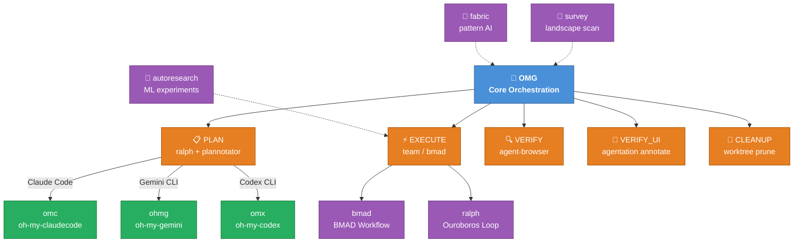
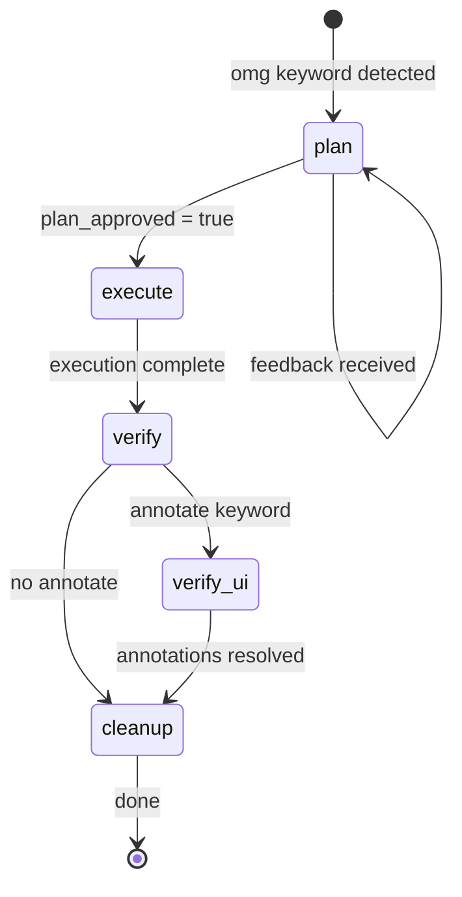
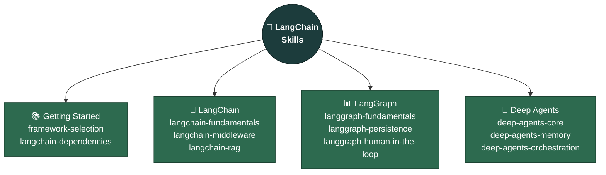

# oh-my-gods

<div align="center">

[](https://github.com/akillness/oh-my-gods)
[](https://github.com/akillness/oh-my-gods)
[](LICENSE)
[](CHANGELOG.md)
[](https://github.com/langchain-ai/langchain-skills)
[](https://www.buymeacoffee.com/akillness3q)

</div>

```
  ██████╗ ██╗  ██╗      ███╗   ███╗██╗   ██╗      ██████╗  ██████╗ ██████╗ ███████╗
 ██╔═══██╗██║  ██║      ████╗ ████║╚██╗ ██╔╝     ██╔════╝ ██╔═══██╗██╔══██╗██╔════╝
 ██║   ██║███████║█████╗██╔████╔██║ ╚████╔╝█████╗██║  ███╗██║   ██║██║  ██║███████╗
 ██║   ██║██╔══██║╚════╝██║╚██╔╝██║  ╚██╔╝ ╚════╝██║   ██║██║   ██║██║  ██║╚════██║
 ╚██████╔╝██║  ██║      ██║ ╚═╝ ██║   ██║         ╚██████╔╝╚██████╔╝██████╔╝███████║
  ╚═════╝ ╚═╝  ╚═╝      ╚═╝     ╚═╝   ╚═╝          ╚═════╝  ╚═════╝ ╚═════╝ ╚══════╝
```

<div align="center">

**Complete Workflow & Skillset for LLM-based AI Agent Development**

*Plan → Execute → Verify → Ship*

> **90+ skills** — new: `strix` — AI-driven application security testing (appsec scans, CI/CD, Docker sandbox) · `langchain-bmad` — BMAD × LangChain unified workflow

[Quick Start](#-quick-start) · [OMG Core](#-omg--core-orchestration-skill) · [Hidden Features](#-hidden-power-features) · [LangChain](#-langchain-integration) · [Full Catalog](#-full-skill-catalog) · [한국어](README.ko.md)

</div>

---

## 🚀 Quick Start

> **Prerequisite**: Install `skills` CLI before running any `npx skills add` commands.

```bash
npm install -g skills
```

```bash
# Send to your LLM agent: read this guide and proceed with installation
curl -s https://raw.githubusercontent.com/akillness/oh-my-gods/main/setup-all-skills-prompt.md
```


```bash
# Manual — core OMG stack
npx skills add https://github.com/akillness/oh-my-gods \
  --skill omg --skill plannotator --skill agentation --skill survey \
  --skill ralph --skill omc --skill bmad
```

| Platform | First Command |
|----------|--------------|
| Claude Code | `omg "task description"` or `/omc:team "task"` |
| Gemini CLI | `/omg "task description"` |
| Codex CLI | `/omg "task description"` |
| OpenCode | `/omg "task description"` |

---

## 🎯 What is oh-my-gods?

`oh-my-gods` is a curated collection of **86+ AI agent skills** designed for LLM-based development workflows. Built around the `omg` orchestration protocol, it provides:

- **Unified orchestration** across Claude Code, Gemini CLI, OpenAI Codex, and OpenCode
- **Plan → Execute → Verify → Cleanup** automated pipelines
- **Multi-agent team coordination** with parallel execution
- **LangChain/LangGraph integration** for framework-aware agent development

---

## 🏗 Architecture



---

## 🧠 OMG — Core Orchestration Skill

> **Keyword**: `omg` · `annotate` · `UI검토`
> **The central nervous system of oh-my-gods**

OMG orchestrates a complete, automated development pipeline across all AI agent platforms.

- **Project management** — `.omg/` folder tracks long-term plans (concept, rules, validation), short-term plans (system, tests), backlog, progress, and history. The OMG agent checks and updates these documents automatically during execution.

```
┌─────────────────────────────────────────────────────────────────┐
│                     OMG WORKFLOW                                │
├──────────┬──────────┬──────────┬──────────┬────────────────────┤
│  STEP 0  │  STEP 1  │  STEP 2  │  STEP 3  │  STEP 4            │
│ Bootstrap│   PLAN   │ EXECUTE  │  VERIFY  │  CLEANUP           │
│          │          │          │          │                    │
│ State    │ ralph    │ omc:team │ agent-   │ worktree           │
│ init     │    +     │    or    │ browser  │ prune              │
│          │ planno-  │  bmad    │    +     │                    │
│          │ tator    │          │ agenta-  │                    │
│          │          │          │ tion     │                    │
└──────────┴──────────┴──────────┴──────────┴────────────────────┘
```

### OMG State Machine



### Platform Support

| Platform | Team Mode | PLAN Gate | VERIFY_UI | Install |
|----------|-----------|-----------|-----------|---------|
| **Claude Code** | `/omc:team` | ExitPlanMode hook | MCP tool | `bash setup-claude.sh` |
| **Gemini CLI** | `ohmg` | AfterAgent hook | HTTP REST | `bash setup-gemini.sh` |
| **Codex CLI** | `omx` | notify hook | HTTP REST | `bash setup-codex.sh` |
| **OpenCode** | `omx` | submit_plan plugin | HTTP REST | `bash setup-opencode.sh` |

---

## 🔮 Hidden Power Features

> These features unlock the full potential of the oh-my-gods ecosystem.

```
╔══════════════════════════════════════════════════════════════════╗
║              HIDDEN POWER FEATURES                               ║
╠══════════════╦═══════════════════════════════════════════════════╣
║  omc         ║  Claude Code 32-agent orchestration layer        ║
║  omx         ║  OpenAI Codex multi-agent orchestration          ║
║  ohmg        ║  Gemini / Antigravity workflows (Google AI)      ║
║  bmad        ║  Structured phase-based development (BMAD)       ║
║  bmad-idea   ║  Creative AI — 5 specialist ideation agents      ║
║  survey      ║  Pre-implementation landscape scan               ║
║  autoresearch║  Autonomous overnight ML experiments (Karpathy)  ║
║  skill-autoresearch║ Eval-driven skill optimization loop        ║
║  fabric      ║  AI prompt patterns & content extraction CLI     ║
║  agentation  ║  UI annotation → agent code fix (annotate)      ║
║  plannotator ║  Visual plan/diff review browser UI              ║
║  agent-browser║ Headless browser verification for AI agents     ║
║  playwriter  ║  Playwright automation with live browser         ║
║  frouter     ║  Free AI model router — discover & configure     ║
║  deepagents  ║  LangGraph batteries-included agent harness      ║
║  clawteam    ║  Framework-agnostic multi-agent coordination CLI  ║
║  agent-manager║ tmux+Python agent lifecycle mgr — no server     ║
║  pm-skills   ║  AI OS for PMs — 65 skills, 36 commands, 8 plugins║
║  ai-research-skills║ 86 AI research skills — from ideation to paper (autonomous)║
║  strix       ║  AI-driven appsec CLI — local/repo/URL scans, CI/CD, Docker sandbox║
╚══════════════╩═══════════════════════════════════════════════════╝
```

| Skill | Keyword | Description | Source |
|-------|---------|-------------|--------|
| `omc` | `omc`, `autopilot` | 32 specialized Claude Code agents with smart model routing, persistent loops, real-time HUD | [oh-my-claudecode](https://github.com/Yeachan-Heo/oh-my-claudecode) |
| `omx` | `omx` | 40+ workflow skills, team orchestration in tmux for OpenAI Codex CLI | Internal |
| `ohmg` | `ohmg` | Google Antigravity/Gemini multi-agent framework with 6 specialist agents | Internal |
| `bmad` | `bmad`, `/workflow-init` | Analysis → Planning → Solutioning → Implementation structured phases | [BMAD Method](https://github.com/bmad-dev/BMAD-METHOD) |
| `bmad-idea` | `bmad-idea` | 5 creative specialist agents — design thinking, innovation, storytelling | Internal |
| `survey` | `survey` | Cross-platform landscape scan before planning; saves artifacts to `.survey/` | Internal |
| `autoresearch` | `autoresearch`, `val_bpb` | Karpathy-style autonomous GPU overnight experiments with git ratchet | Karpathy methodology |
| `skill-autoresearch` | `skill-autoresearch`, `optimize this skill` | Eval-driven loop for improving an existing SKILL.md with binary checks and mutation tracking | olelehmann100kMRR/autoresearch-skill |
| `fabric` | `fabric` | AI prompt orchestration via reusable Patterns; YouTube summaries, doc analysis | [fabric](https://github.com/danielmiessler/fabric) |
| `agentation` | `annotate`, `UI검토` | Click UI elements → AI applies targeted code fixes via CSS selectors | [agentation](https://github.com/benjitaylor/agentation) |
| `plannotator` | `plan` | Visual browser UI for reviewing AI-generated plans; approve or send feedback | [plannotator](https://plannotator.ai) |
| `agent-browser` | `agent-browser` | Headless browser snapshot & verification for AI agents | npm:agent-browser |
| `playwriter` | `playwriter` | Playwright automation connecting to your *running* browser (preserves cookies/logins) | Internal |
| `frouter` | `frouter`, `--best` | Free AI model router — discover, benchmark & configure NVIDIA NIM / OpenRouter models for OpenCode/OpenClaw | [jyoung105/frouter](https://github.com/jyoung105/frouter) |
| `deepagents` | `deepagents`, `create_deep_agent` | Batteries-included LangGraph agent harness — file tools, middleware, subagents, HITL out of the box | [langchain-ai/deepagents](https://github.com/langchain-ai/deepagents) |
| `clawteam` | `clawteam`, `agent swarm` | Framework-agnostic multi-agent coordination CLI — spawn tmux teams, task queues, inboxes, kanban board | [HKUDS/ClawTeam](https://github.com/HKUDS/ClawTeam) |
| `agent-manager` | `agent-manager`, `start agent`, `stop agent`, `monitor agent` | tmux + Python agent lifecycle manager — start/stop/monitor/schedule/heartbeat without a server | [fractalmind-ai/agent-manager-skill](https://github.com/fractalmind-ai/agent-manager-skill) |
| `pm-skills` | `pm-skills`, `product discovery`, `write PRD`, `user stories`, `product strategy` | AI OS for product managers — 65 skills, 36 commands across 8 plugins (Teresa Torres, Marty Cagan, Alberto Savoia) | [phuryn/pm-skills](https://github.com/phuryn/pm-skills) |
| `ai-research-skills` | `ai-research-skills`, `autoresearch`, `ml experiments`, `fine-tuning`, `grpo`, `vllm`, `rlhf` | 86 AI research skills (22 categories) for autonomous research — fine-tuning, RLHF, GRPO, vLLM, RAG, multimodal, ML papers | [Orchestra-Research/AI-Research-SKILLs](https://github.com/Orchestra-Research/AI-Research-SKILLs) |
| `strix` | `strix`, `ai pentest`, `vulnerability scan cli`, `appsec scan`, `strix ci` | AI-driven application security CLI — authorized scans against local dirs, GitHub repos, live URLs; quick/standard/deep modes; Docker sandbox; CI/CD headless mode | [usestrix/strix](https://github.com/usestrix/strix) |

---

## 🔗 LangChain Integration

> **Source**: [`langchain-ai/langchain-skills`](https://github.com/langchain-ai/langchain-skills/tree/main)
> MIT License — Official LangChain AI skills for agent development

oh-my-gods integrates the official LangChain skills collection, providing framework-aware guidance for building LangChain/LangGraph/Deep Agents applications.

```bash
# Install all LangChain skills
npx skills add langchain-ai/langchain-skills --skill '*' --yes
```

### LangChain Skill Map



### Framework Selection Guide

| Use Case | Recommended Framework |
|----------|----------------------|
| Multi-step tasks, file management, on-demand skills | **Deep Agents** |
| Complex control flow (loops, branching, parallelization) | **LangGraph** |
| Simple single-purpose agent with tools | **LangChain** `create_agent()` |
| Pure model call / retrieval pipeline | **LangChain LCEL** |

### LangChain Skill Catalog

| Skill | Trigger | Description |
|-------|---------|-------------|
| `framework-selection` | "which framework", "LangChain vs" | Choose LangChain/LangGraph/Deep Agents |
| `langchain-dependencies` | "install langchain", "package versions" | Package setup and version management |
| `langchain-fundamentals` | "langchain agent", "create_agent" | Agent creation, tools, HITL patterns |
| `langchain-middleware` | "human in the loop", "approval workflow" | HITL approval, custom middleware |
| `langchain-rag` | "RAG", "retrieval", "vector store" | Complete RAG pipeline implementation |
| `langgraph-fundamentals` | "langgraph", "StateGraph" | Graph nodes, edges, streaming |
| `langgraph-persistence` | "persist state", "checkpointer" | State persistence, PostgresSaver |
| `langgraph-human-in-the-loop` | "interrupt", "pause for approval" | HITL patterns, idempotency |
| `deep-agents-core` | "deep agent", "create_deep_agent" | Deep Agents architecture & middleware |
| `deep-agents-memory` | "agent memory", "StoreBackend" | Memory, persistence, filesystem |
| `deep-agents-orchestration` | "subagent", "todo list", "HITL" | Subagents, task planning, approval |
| `langchain-bmad` | "langchain bmad", "bmad langchain", "structured agent" | BMAD × LangChain unified workflow — install both skill sets and follow phase-gated development |

### Combined Install (LangChain + BMAD)

```bash
# Install BMAD + all 11 LangChain skills together
npx skills add https://github.com/akillness/oh-my-gods --skill bmad --skill langchain-bmad
npx skills add langchain-ai/langchain-skills --skill '*' --yes
```

---

## 📚 Full Skill Catalog

### Core Orchestration

| Skill | Keyword | Platform | Description |
|-------|---------|----------|-------------|
|  | `omg` |  | `omg` | All | Integrated orchestration: PLAN→EXECUTE→VERIFY→CLEANUP |
| `omc` | `omc`, `autopilot` | Claude Code | 32-agent multi-agent orchestration layer |
| `omx` | `omx` | Codex CLI | 40+ workflow skills, tmux team orchestration |
| `ohmg` | `ohmg` | Gemini CLI | Antigravity multi-agent framework |
| `ralph` | `ralph`, `ooo` | All | Ouroboros specification-first + persistent completion loop |
| `ralphmode` | `ralphmode` | All | Automation permission profiles (sandbox-first, repo boundary) |
| `bmad` | `bmad`, `/workflow-init` | All | Structured phase-based AI development |
| `bmad-idea` | `bmad-idea` | All | Creative intelligence — 5 specialist ideation agents |
| `survey` | `survey` | All | Pre-implementation landscape scan |
| `clawteam` | `clawteam`, `agent swarm` | All | Framework-agnostic multi-agent coordination — spawn tmux teams, task queues, kanban board |
| `pm-skills` | `pm-skills`, `product discovery`, `write PRD` | All | AI OS for product managers — 65 skills, 36 commands, 8 plugins encoding PM frameworks |

### Planning & Review

| Skill | Keyword | Description |
|-------|---------|-------------|
| `plannotator` | `plan` | Visual browser plan/diff review |
| `agentation` | `annotate`, `UI검토` | UI annotation → targeted code fixes |
| `agent-browser` | `agent-browser` | Headless browser verification |
| `playwriter` | `playwriter` | Playwright with live browser (cookies preserved) |
| `frouter` | `frouter` | Free AI model router — discover, ping & apply best free model to OpenCode/OpenClaw |
| `vibe-kanban` | `kanbanview` | Visual Kanban board for agent tasks |

### Development Workflow

| Skill | Description |
|-------|-------------|
| `agent-development-principles` | Universal AI collaboration principles (divide-and-conquer, context management) |
| `agent-principles` | Core principles for AI agent collaboration |
| `agent-workflow` | Daily workflow optimization: shortcuts, Git, MCP, sessions |
| `agent-configuration` | Agent policy, security, hooks/skills/plugins setup |
| `agent-evaluation` | Comprehensive agent evaluation system design |
| `git-workflow` | Commit, branch, merge, PR workflows |
| `git-submodule` | Git submodule management |
| `debugging` | Root cause analysis, regression isolation |
| `code-review` | Comprehensive code review with API contracts |
| `agent-manager` | tmux + Python agent lifecycle manager — start/stop/monitor/schedule/heartbeat without a server |

### Backend & Infrastructure

| Skill | Description |
|-------|-------------|
| `api-design` | RESTful and GraphQL API design |
| `api-documentation` | OpenAPI/Swagger docs generation |
| `authentication-setup` | JWT, OAuth, session management |
| `backend-testing` | Unit/integration/API test strategies |
| `database-schema-design` | SQL/NoSQL schema design and optimization |
| `deployment-automation` | CI/CD, Docker/Kubernetes, cloud infrastructure |
| `environment-setup` | Dev/staging/production environment config |
| `monitoring-observability` | Health checks, metrics, log aggregation |
| `security-best-practices` | OWASP Top 10, RBAC, API security |
| `strix` | AI-driven appsec CLI — authorized vulnerability scans (local, GitHub, URLs), Docker sandbox, CI/CD headless mode |

### Frontend & Design

| Skill | Description |
|-------|-------------|
| `design-system` | Design tokens, layout rules, motion guidance |
| `frontend-design-system` | Production-grade UI with accessibility |
| `responsive-design` | Mobile-first layouts, breakpoints |
| `ui-component-patterns` | Reusable component libraries |
| `react-best-practices` | React/Next.js performance optimization |
| `vercel-react-best-practices` | Vercel Engineering React guidelines |
| `state-management` | Redux, Context, Zustand patterns |
| `web-accessibility` | WCAG 2.1 compliance |
| `web-design-guidelines` | Web Interface Guidelines compliance review |

### AI & Data

| Skill | Description |
|-------|-------------|
| `autoresearch` | Autonomous ML experiments (Karpathy methodology) |
| `skill-autoresearch` | Eval-driven optimization loop for improving an existing SKILL.md |
| `fabric` | AI prompt patterns — YouTube summaries, doc analysis · [LM Studio 설정](docs/fabric/README.md) |
| `langextract` | LLM-powered structured extraction from text with character-level provenance (Gemini/OpenAI/Ollama) |
| `genkit` | Firebase Genkit AI flows and RAG pipelines |
| `firebase-ai-logic` | Gemini in Firebase integration |
| `data-analysis` | Dataset analysis, visualizations, statistics |
| `llm-monitoring-dashboard` | LLM usage monitoring page generator |
| `ai-tool-compliance` | Internal AI tool compliance automation (P0/P1) |
| `opencontext` | Persistent memory and context management |
| `prompt-repetition` | LLM accuracy via prompt repetition technique |
| `deepagents` | Batteries-included LangGraph agent harness — `create_deep_agent()`, middleware, subagents, HITL |
| `ai-research-skills` | 86 AI research skills (22 categories) — autoresearch orchestration, fine-tuning, RLHF/GRPO, vLLM, RAG, multimodal, ML paper writing |
| `langchain-bmad` | BMAD × LangChain unified workflow — phase-gated development with `framework-selection` → `langgraph-*` → `deep-agents-*` |

### Content & Media

| Skill | Description |
|-------|-------------|
| `presentation-builder` | HTML slides with `slides-grab`, export to PPTX/PDF |
| `video-production` | Remotion-based programmable video production |
| `image-generation` | Image generation via Gemini/compatible APIs |
| `pollinations-ai` | Free image generation (no API key needed) |
| `marketing-automation` | 23 sub-skills: CRO, copywriting, SEO, growth |

---

## 📦 Installation Reference

### Full Install (Recommended)

```bash
# Prerequisite
npm install -g skills

# One-liner (recommended)
curl -fsSL https://raw.githubusercontent.com/akillness/oh-my-gods/main/install.sh | bash

# Or manually — install all skills
npx skills add https://github.com/akillness/oh-my-gods \
  --skill agent-configuration --skill agent-evaluation \
  --skill agent-development-principles --skill agent-principles \
  --skill agent-workflow --skill bmad \
  --skill bmad-gds --skill bmad-idea \
  --skill prompt-repetition --skill api-design \
  --skill api-documentation --skill authentication-setup \
  --skill backend-testing --skill database-schema-design \
  --skill design-system --skill frontend-design-system \
  --skill react-best-practices --skill vercel-react-best-practices \
  --skill responsive-design --skill state-management \
  --skill ui-component-patterns --skill web-accessibility \
  --skill web-design-guidelines --skill code-refactoring \
  --skill code-review --skill debugging \
  --skill performance-optimization --skill testing-strategies \
  --skill deployment-automation --skill firebase-ai-logic \
  --skill genkit --skill monitoring-observability \
  --skill security-best-practices --skill environment-setup \
  --skill vercel-deploy --skill changelog-maintenance \
  --skill presentation-builder --skill technical-writing \
  --skill user-guide-writing --skill sprint-retrospective \
  --skill standup-meeting --skill task-estimation \
  --skill task-planning --skill codebase-search \
  --skill data-analysis --skill log-analysis \
  --skill pattern-detection --skill llm-monitoring-dashboard \
  --skill image-generation --skill pollinations-ai \
  --skill video-production --skill marketing-automation \
  --skill agent-browser --skill agentation \
  --skill ai-tool-compliance --skill file-organization \
  --skill git-submodule --skill git-workflow --skill omg \
  --skill ohmg --skill omx --skill omc \
  --skill opencontext --skill plannotator --skill playwriter \
  --skill ralph --skill ralphmode --skill skill-standardization \
  --skill survey --skill vibe-kanban --skill workflow-automation \
  --skill fabric --skill autoresearch --skill langextract \
  --skill frouter --skill deepagents --skill clawteam \
  --skill agent-manager --skill pm-skills \
  --skill ai-research-skills \
  --skill langchain-bmad \
  --skill strix

# Also install LangChain skills
npx skills add langchain-ai/langchain-skills --skill '*' --yes
```

### Platform-Specific Setup

```bash
# Claude Code (oh-my-claudecode)
/plugin marketplace add https://github.com/Yeachan-Heo/oh-my-claudecode
/omc:omc-setup
bash ~/.agent-skills/omg/scripts/setup-claude.sh

# Gemini CLI
bash ~/.agent-skills/omg/scripts/setup-gemini.sh
gemini extensions install https://github.com/akillness/oh-my-gods

# Codex CLI
bash ~/.agent-skills/omg/scripts/setup-codex.sh

# OpenCode
bash ~/.agent-skills/omg/scripts/setup-opencode.sh
```

### Environment Requirements

```bash
# Required
node >= 18
git
bash

# Optional (platform-specific)
bun            # faster installs
docker         # container workflow
npx agentation-mcp server  # UI annotation
npm install -g agent-browser  # browser verification
```

---

## 💛 Support the Project

If oh-my-gods has been helpful to you, consider supporting the project!

<div align="center">

[](https://www.buymeacoffee.com/akillness3q)


</div>

---

## 📎 References & Sources

| Component | Source | License |
|-----------|--------|---------|
|  | `omg` | [akillness/oh-my-gods](https://github.com/akillness/oh-my-gods) | MIT |
| `omc` | [Yeachan-Heo/oh-my-claudecode](https://github.com/Yeachan-Heo/oh-my-claudecode) | MIT |
| `ralph` | [Q00/ouroboros](https://github.com/Q00/ouroboros) | MIT |
| `plannotator` | [backnotprop/plannotator](https://plannotator.ai) | MIT |
| `bmad` | [bmad-dev/BMAD-METHOD](https://github.com/bmad-dev/BMAD-METHOD) | MIT |
| `agentation` | [benjitaylor/agentation](https://github.com/benjitaylor/agentation) | MIT |
| `fabric` | [danielmiessler/fabric](https://github.com/danielmiessler/fabric) | MIT |
| `autoresearch` | Andrej Karpathy methodology | — |
| `agent-manager` | [fractalmind-ai/agent-manager-skill](https://github.com/fractalmind-ai/agent-manager-skill) | MIT |
| LangChain skills | [langchain-ai/langchain-skills](https://github.com/langchain-ai/langchain-skills) | MIT |
| `langextract` | [google/langextract](https://github.com/google/langextract) | Apache-2.0 |
| `deepagents` | [langchain-ai/deepagents](https://github.com/langchain-ai/deepagents) | MIT |
| `clawteam` | [HKUDS/ClawTeam](https://github.com/HKUDS/ClawTeam) | MIT |
| `pm-skills` | [phuryn/pm-skills](https://github.com/phuryn/pm-skills) | MIT |
| `ai-research-skills` | [Orchestra-Research/AI-Research-SKILLs](https://github.com/Orchestra-Research/AI-Research-SKILLs) | MIT |
| `agent-development-principles` | [ykdojo/claude-code-tips](https://github.com/ykdojo/claude-code-tips) + Ado Kukic | MIT |
| `frouter` | [jyoung105/frouter](https://github.com/jyoung105/frouter) | MIT |
| `strix` | [usestrix/strix](https://github.com/usestrix/strix) | Apache-2.0 |
| Agent Skills Spec | [agentskills.io](https://agentskills.io/specification) | — |

---

<div align="center">

Made with ❤️ by [JEO-tech-ai](https://github.com/JEO-tech-ai)

⭐ If this helps you, please star the repository!

```bash
gh api --silent --method PUT /user/starred/akillness/oh-my-gods >/dev/null 2>&1
```

</div>
