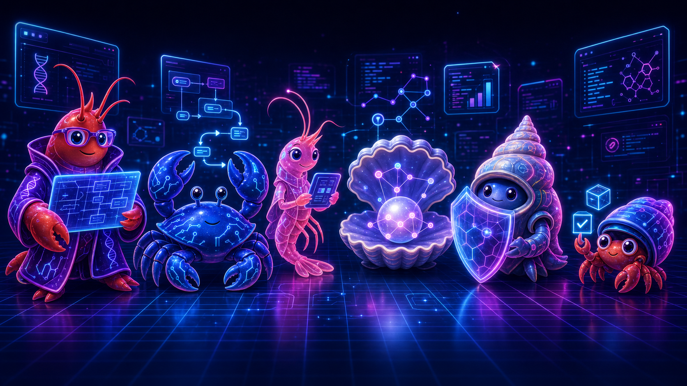
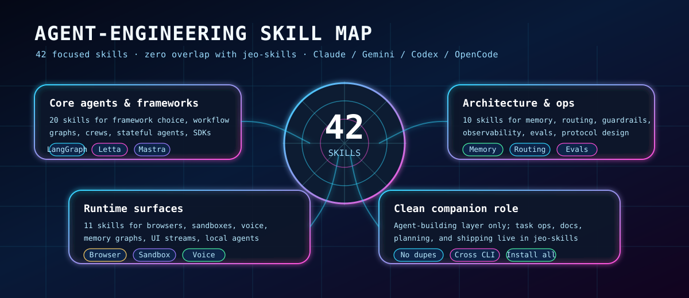

<div align="center">
  
</div>

# oh-my-gods

<div align="center">

[](https://github.com/akillness/oh-my-gods)

[](https://github.com/akillness/oh-my-gods)
[](LICENSE)
[](https://www.buymeacoffee.com/akillness3q)

</div>

<div align="center">

**Agent-engineering skills for building, evaluating, and operating LLM agents**

*42 focused skills · no duplication with [jeo-skills](https://github.com/akillness/jeo-skills) · cross-platform*



[Quick Start](#-quick-start) · [Skill Catalog](#-skill-catalog) · [Installation](#-installation) · [한국어](README.ko.md)

</div>

---

## 🎯 What is oh-my-gods?

`oh-my-gods` is a lean, **agent-engineering** skill set — the layer you reach for when *building the agent itself*: architecture, memory, tool routing, guardrails, evaluation, observability, and multi-agent protocols.

It is deliberately scoped to **not duplicate** [`jeo-skills`](https://github.com/akillness/jeo-skills). General development workflow, orchestration (`omg`/`omc`/`omx`/`ohmg`), planning, frontend/backend, and content skills all live there. oh-my-gods keeps only the **42 agent-focused skills** that complement that collection.

| You want to… | Use |
|--------------|-----|
| Design agent memory, tools, guardrails, evals | **oh-my-gods** (this repo) |
| Orchestrate a dev task, plan, ship, write docs | [jeo-skills](https://github.com/akillness/jeo-skills) |

---

## 🚀 Quick Start

> **Prerequisite**: the `skills` CLI.

```bash
npm install -g skills
```

```bash
# One-liner install
curl -fsSL https://raw.githubusercontent.com/akillness/oh-my-gods/main/install.sh | bash
```

```bash
# Or hand the LLM-driven guide to your agent
curl -s https://raw.githubusercontent.com/akillness/oh-my-gods/main/setup-all-skills-prompt.md
```

```bash
# Or install everything directly
npx skills add -g https://github.com/akillness/oh-my-gods --skill '*' --yes
```

---

## 📚 Skill Catalog

### Core Agent & Frameworks (20)

| Skill | Description |
|-------|-------------|
| `agent-configuration` | AGENTS.md, hooks, permissions, skills/plugins/MCP setup |
| `agent-evaluation` | Eval systems: graders, CI gates, production monitoring |
| `agent-manager` | tmux + Python lifecycle — start/stop/monitor/schedule/heartbeat |
| `agent-principles` | Core AI-agent collaboration: context, plan/execute, verify |
| `agent-workflow` | Day-to-day coding-agent loops: session recovery, worktrees, handoffs |
| `agents-cli` | Google Cloud agent lifecycle — scaffold, evaluate, deploy |
| `deepagents` | LangGraph batteries-included harness — file tools, subagents, HITL |
| `langchain-bmad` | BMAD phase gates ↔ LangChain / LangGraph / Deep Agents routing |
| `langgraph-workflow` | StateGraph, checkpointing, conditional branching, parallel nodes |
| `ralph` | Ouroboros spec-first loop — interview → seed → execute → evaluate → evolve |
| `ralphmode` | Sandbox + approval profiles for long-running agent loops |
| `crewai` | Role-based multi-agent framework — crews, flows, tasks, tools |
| `agno` | High-performance multi-agent framework (ex phidata) — AgentOS runtime |
| `smolagents` | HuggingFace minimal code-first agents — CodeAgent writes actions as Python |
| `mastra` | TypeScript agent framework — agents, workflows, RAG, evals, observability |
| `letta` | Stateful agents with self-editing memory (MemGPT lineage) — memory blocks |
| `claude-agent-sdk` | Anthropic's official SDK to build agents on the Claude Code harness |
| `google-adk` | Google Agent Development Kit — code-first multi-agent |
| `openclaw` | Personal AI assistant/agent runtime — gateway, channels, skills, node mode |
| `pi-agent` | Minimal hackable coding agent + TypeScript toolkit monorepo |

### Agent Architecture & Ops (10)

| Skill | Description |
|-------|-------------|
| `agent-observability` | LangSmith/Langfuse/Phoenix selection, node-level traces, replay, eval-in-trace |
| `agent-memory-architecture` | mem0/Letta/Zep selection, tiered core/recall/archival, temporal vs snapshot |
| `mcp-server-design` | MCP servers — Server Cards, stateless transports, registry compliance |
| `agent-guardrails` | NeMo Colang + Lakera/LLM Guard — prompt injection, exfiltration, tool misuse |
| `agent-system-design` | Agent SLA discipline: MAX_LOOPS, cost budgets, circuit breakers, sovereignty |
| `agent-tool-routing` | Tool registries, capability discovery, schemas, router policies, fallbacks |
| `multi-agent-eval-harness` | Role-level metrics, coordination-failure tests, transcript grading |
| `a2a-protocol` | Agent-to-Agent horizontal messaging (Linux Foundation AAIF 2026 standard) |
| `reflexion-pattern` | Critic node + verbal memory of failures, stable rubric scoring, retry budgets |
| `agent-benchmarking` | Map capabilities to SWE-bench/WebArena/OSWorld + custom regression packs |

### Sandbox, Browser, Voice, Memory & Protocols (11)

| Skill | Description |
|-------|-------------|
| `browser-use` | Make websites accessible for AI agents — autonomous browsing, DOM extraction |
| `stagehand` | Production browser automation SDK mixing code and natural language |
| `mem0` | Universal memory layer for AI agents — add/search memories, graph memory |
| `graphiti` | Real-time temporal knowledge graphs for agent memory |
| `e2b` | Open-source cloud sandboxes for AI code execution — Firecracker microVMs |
| `daytona` | Secure elastic infrastructure for running AI-generated code — sub-90ms sandboxes |
| `livekit-agents` | Realtime voice AI agents on LiveKit WebRTC — STT/LLM/TTS pipelines |
| `pipecat` | Open-source framework for realtime voice and multimodal conversational agents |
| `ag-ui` | Agent-User Interaction protocol — event-based agent-to-frontend streaming |
| `goose` | Extensible local AI agent (Rust), MCP-native extensions, CLI + desktop |
| `openhands` | Software-development agent platform — CLI, GUI, GitHub actions, sandboxed runtime |

### Compatibility Aliases (1)

| Skill | Description |
|-------|-------------|
| `agent-development-principles` | Compatibility alias of `agent-principles` (routes there) |

---

## 🤝 Collaborative Agent Ecosystem (Duo with jeo-skills)


The developer workspace is built for a team of autonomous AI agents working in harmony. Inspired by the [`jeo-code`](https://github.com/akillness/jeo-code) neon mascot, the companion image recasts those digital peers as friendly sea-creature agents — crayfish, crab, shrimp, clam, conch, and hermit-crab specialists.

This repository (`oh-my-gods`) and [`jeo-skills`](https://github.com/akillness/jeo-skills) form the ultimate agent developer duo:

| Layer | Responsibility | Project |
|---|---|---|
| **Agent Engineering** | Sandboxing, memory layers, tool routing, guardrails, evaluation, protocols | **oh-my-gods** (this repo) |
| **Workflow & Task Ops** | Task planning, git workflow, documentation, multi-agent orchestration (`omg`/`omc`/`omx`/`ohmg`) | [jeo-skills](https://github.com/akillness/jeo-skills) |

Together, they provide a comprehensive and robust foundation for building, executing, and deploying autonomous developer syndicates.

---
## 📦 Installation

```bash
# Prerequisite
npm install -g skills

# Recommended — one-liner
curl -fsSL https://raw.githubusercontent.com/akillness/oh-my-gods/main/install.sh | bash

# Or all 42 skills explicitly
npx skills add -g https://github.com/akillness/oh-my-gods --skill '*' --yes
```

**Environment**: `node >= 18`, `git`, `bash`. Skills are copied to `~/.agent-skills` and fanned out to `~/.claude/skills`, `~/.codex/skills`, `~/.gemini/skills`, and `~/.opencode/skills`.

See [`setup-all-skills-prompt.md`](setup-all-skills-prompt.md) for the full LLM-driven install/verify walkthrough.

---

## 📎 References & Sources

| Skill | Source | License |
| `ralph` | [Q00/ouroboros](https://github.com/Q00/ouroboros) | MIT |
| `deepagents` | [langchain-ai/deepagents](https://github.com/langchain-ai/deepagents) | MIT |
| `agent-manager` | [fractalmind-ai/agent-manager-skill](https://github.com/fractalmind-ai/agent-manager-skill) | MIT |
| `agent-development-principles` | [ykdojo/claude-code-tips](https://github.com/ykdojo/claude-code-tips) | MIT |
| `a2a-protocol` | Linux Foundation AAIF | — |
| `openclaw` | [openclaw/openclaw](https://github.com/openclaw/openclaw) | MIT |
| `pi-agent` | [earendil-works/pi](https://github.com/earendil-works/pi) | MIT |
| `goose` | [aaif-goose/goose](https://github.com/aaif-goose/goose) | Apache-2.0 |
| `openhands` | [OpenHands/OpenHands](https://github.com/OpenHands/OpenHands) | MIT |
| `claude-agent-sdk` | [anthropics/claude-agent-sdk-python](https://github.com/anthropics/claude-agent-sdk-python) | MIT |
| `google-adk` | [google/adk-python](https://github.com/google/adk-python) | Apache-2.0 |
| `crewai` | [crewAIInc/crewAI](https://github.com/crewAIInc/crewAI) | MIT |
| `agno` | [agno-agi/agno](https://github.com/agno-agi/agno) | Apache-2.0 |
| `smolagents` | [huggingface/smolagents](https://github.com/huggingface/smolagents) | Apache-2.0 |
| `mastra` | [mastra-ai/mastra](https://github.com/mastra-ai/mastra) | Elastic-2.0 |
| `letta` | [letta-ai/letta](https://github.com/letta-ai/letta) | Apache-2.0 |
| `browser-use` | [browser-use/browser-use](https://github.com/browser-use/browser-use) | MIT |
| `stagehand` | [browserbase/stagehand](https://github.com/browserbase/stagehand) | MIT |
| `mem0` | [mem0ai/mem0](https://github.com/mem0ai/mem0) | Apache-2.0 |
| `graphiti` | [getzep/graphiti](https://github.com/getzep/graphiti) | Apache-2.0 |
| `e2b` | [e2b-dev/E2B](https://github.com/e2b-dev/E2B) | Apache-2.0 |
| `daytona` | [daytonaio/daytona](https://github.com/daytonaio/daytona) | AGPL-3.0 / Apache-2.0 |
| `livekit-agents` | [livekit/agents](https://github.com/livekit/agents) | Apache-2.0 |
| `pipecat` | [pipecat-ai/pipecat](https://github.com/pipecat-ai/pipecat) | BSD-2-Clause |
| `ag-ui` | [ag-ui-protocol/ag-ui](https://github.com/ag-ui-protocol/ag-ui) | MIT |
| Agent Skills Spec | [agentskills.io](https://agentskills.io/specification) | — |

---

<div align="center">

If oh-my-gods helps you, consider supporting the project!

[](https://www.buymeacoffee.com/akillness3q)


Made with ❤️ by [JEO-tech-ai](https://github.com/JEO-tech-ai) — ⭐ star the repo if it helps!

</div>
